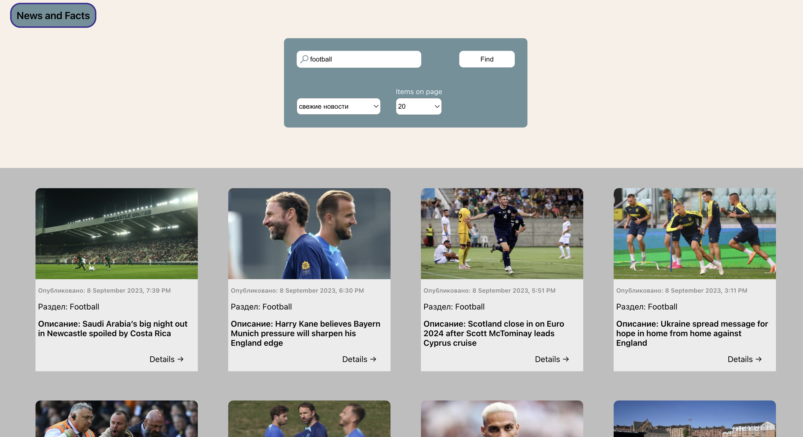
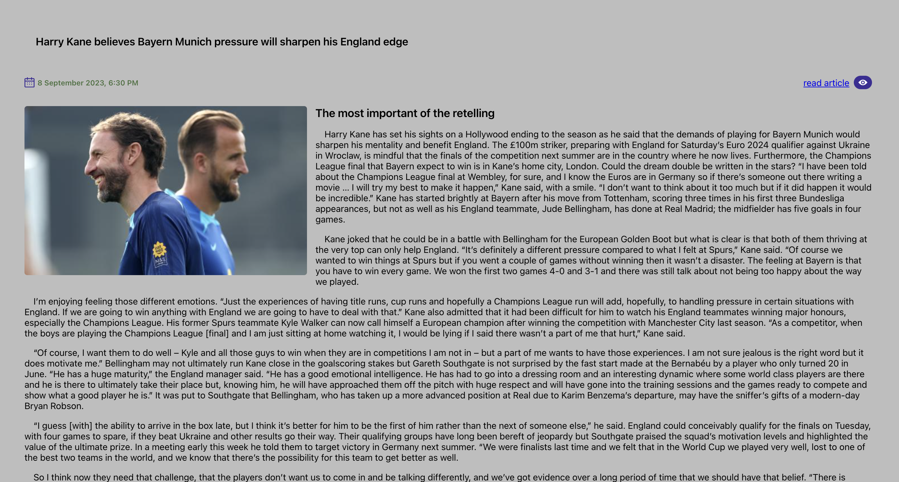
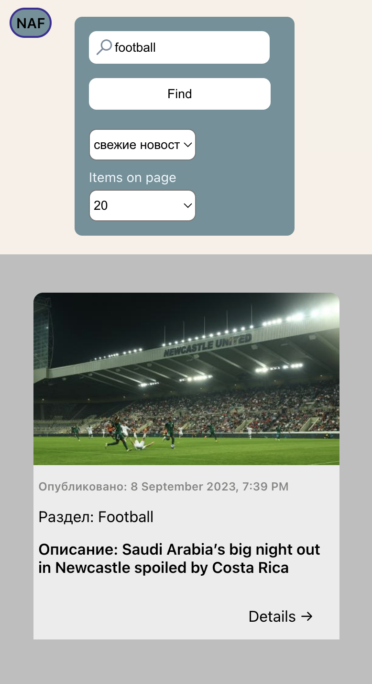

# News And Facts
Сайт для поиска новостей на английском языке

### Стек

1. React
2. Typescript
3. React-Router-Dom (v6)
4. CSS-modules
5. Redux toolkit


### Функционал

1. Основная страница, на которой можно найти новости по ключевому слову в поисковом меню, например, "books", "Sports" и т.д.
2. Также можно выбрать количество новостных карточек, которые будут отображаться. Выберите цифру в поле "Page", укажите ключевое слово и нажмите 'Find'. Новостные карточки можно фильтровать по релевантности и дате новости.
3. Реализована подгрузка новостей со следующей страницы при скролле до последней новости на странице.
4. Нажав на кнопку "Подробнее" на карточке, вы перейдете на вторую страницу и увидите подробную информацию. Также можно перейти на сайт новостного портала, нажав кнопку "read article".
5. PA-приложение, использующее Guardian API в качестве бэкенда.
6. Реализация для десктопных и мобильных экранов.


### Архитектура

Архитектура проекта состоит из
1. Страниц (Pages)
3. Компонентов (Components)

### Начало работы

Установка зависимостей

```
yarn install
```

Запуск приложения

```
yarn start
```

### Перейти на сайт можно по ссылке:
https://igorgap.github.io/NewsApp/


<p>
</p>

<p>
</p>

<p>
</p>

<p>
</p>

<p>
